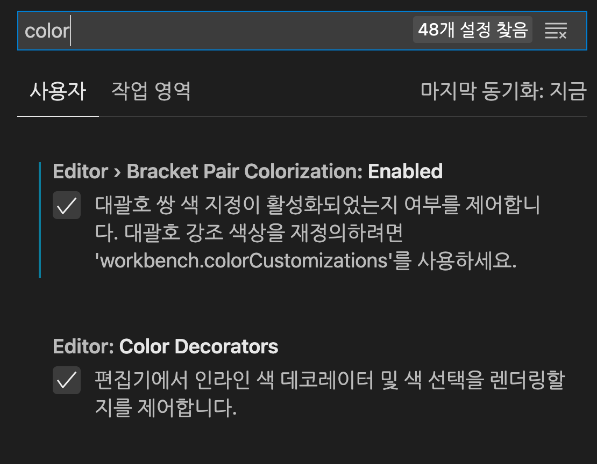
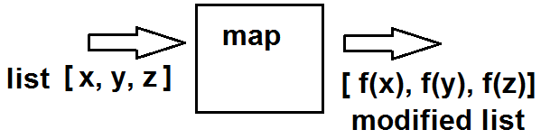
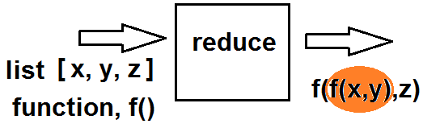

# Workshop

## Contents

- Mac setting
- Terminal setting
- VS code setting
- Project setting
  - Project environment
  - Project folder
  - Project backup (feat. git)
  - Project workflow (feat. make, snakemake)
- Multiprocessing

## Mac setting

## Terminal setting

### Brew Install

```bash
/bin/bash -c "$(curl -fsSL https://raw.githubusercontent.com/Homebrew/install/HEAD/install.sh)"
```

### Install iTerm2

```bash
brew install --cask iterm2
```

### Install git

```bash
brew install git
```

### Install oh-my-zsh

```bash
sh -c "$(curl -fsSL https://raw.githubusercontent.com/robbyrussell/oh-my-zsh/master/tools/install.sh)"
```

### Install font

```bash
https://github.com/Falkor/dotfiles/blob/master/fonts/SourceCodePro%2BPowerline%2BAwesome%2BRegular.ttf
```

### Install theme

```bash
git clone https://github.com/romkatv/powerlevel10k.git $ZSH_CUSTOM/themes/powerlevel10k
```

set theme in `.zshrc`

```bash
ZSH_THEME="powerlevel10k/powerlevel10k"
```

### Update iterm2 preferences

### Configure Power Level 10K

Re-run the iterm2

or

```bash
p10k configure
```

### Enable suggestions

```bash
git clone https://github.com/zsh-users/zsh-autosuggestions ${ZSH_CUSTOM:-~/.oh-my-zsh/custom}/plugins/zsh-autosuggestions
```

set plugins in `.zshrc`

```bash
plugins=(zsh-autosuggestions)
```

### Enable syntax-highlighting

```bash
git clone https://github.com/zsh-users/zsh-syntax-highlighting.git ${ZSH_CUSTOM:-~/.oh-my-zsh/custom}/plugins/zsh-syntax-highlighting
```

set plugins in `.zshrc`

```bash
plugins=(zsh-syntax-highlighting)
```

### Install exa(alternative to `ls`)

`ls` 대용으로 사용할 수 있는 명령어. color로 나오기 때문에 직관적이고 빠르다.

```bash
brew install exa
```

### Code terminal font setting

- editor - D2Coding ligature
- terminal code - 'SourceCodePro+PowerLine+AwesomeRegular' d/t powerline10k

%20c98846484a9b4381ab52a979b5a90fa9/Untitled.png>)

반드시 작은 따옴표가 있어야 한다.

'SourceCodePro+PowerLine+AwesomeRegular'

## VS code setting

### Python

### R

- R

### Git

- git graph
- git lens

### Remote-SSH

### Others

- copilot
- color bracket
  

## Project setting

### Project environment

- pyenv
- poetry

  ```
  poetry config virtualenvs.in-project true
  poetry config virtualenvs.path "./.venv"

  poetry install && poetry update
  ```

### Project folder

### Project backup (feat. git)

### Project workflow (feat. make, snakemake)

## Multiprocessing

### Python

- Python의 특징

  > CPython implementation detail: CPython에서는, 전역 인터프리터 록으로 인해 한 번에 하나의 스레드만 파이썬 코드를 실행할 수 있습니다 (설사 일부 성능 지향 라이브러리가 이 제한을 극복할 수 있을지라도). 응용 프로그램에서 멀티 코어 기계의 계산 자원을 더 잘 활용하려면 multiprocessing이나 concurrent.futures.ProcessPoolExecutor를 사용하는 것이 좋습니다. 그러나, 여러 I/O 병목 작업을 동시에 실행하고 싶을 때 threading은 여전히 적절한 모델입니다.

- The most basic method

  ```{python}
  import multiprocessing

  def my_function():
    print('sleeping 1 seconds....')
    time.sleep(1)
    print('Done sleeping...')

  p1 = multiprocessing.Process(target = my_function) # my_function에 적절한 함수. ()는 필요없다.
  p2 = multiprocessing.Process(target = my_function)

  p1.start() #thread 걸린 함수 실행
  p2.start()

  p1.join() #thread가 끝날때까지 기다린다.
  p2.join()
  ```

- with `Pool` in `multiprocessing` module

  ```{python}
    import concurrent.futures

    with concurrent.futures.ProcessPoolExecutor() as executor:
        f1 = executor.submit(my_function, 1)
        f2 = executor.submit(my_function, 1)

        print(f1.result())
        print(f2.result())
  ```

- with `concurrent.future` module

  ```{python}
  import concurrent.futures

  with concurrent.futures.ProcessPoolExecutor() as executor:
      f1 = executor.submit(my_function, 1)
      f2 = executor.submit(my_function, 1)

      print(f1.result())
      print(f2.result())
  ```

- in `Mac`
  ```{python}
    import multiprocessing as mp
    with concurrent.futures.ProcessPoolExecutor(mp_context=mp.get_context('fork')) as executor:
        ...
  ```

## R

- `purrr` packages from `tidyverse`
- `furrr` packages

### Prerequisite concept

- `map`
  
- `reduce`
  

### `purrr` package

- Install and Load

  ```
  install.packages('tidyverse')
  library(tidyverse)
  ```

- [cheatsheet](src/purrr.pdf)

- e.g.1 read files

  ```
  read_file <- function(filename){
  table <- read_csv(file.path(path,filename)) %>%
      mutate(f = str_sub(filename, 1, -5))
  }

  file_list <- list.files(path = path, pattern = '*_noise.csv')
  tbls <- file_list %>% map_df(~read_file(.))
  ```

- e.g.2 create continuous columns
  ```
  1:6 %>%
    purrr::map_chr(~{glue::glue("question", .x)})
  #> [1] "question1" "question2" "question3" "question4" "question5" "question6"
  ```

### furrr

- Install and Load

```
install.packages("furrr")
library(furrr)
```

e.g [furrr_example.R](./furrr_example.R)

```
library(tidyverse)
library(furrr)
library(future.apply)
library(tictoc)

no_cores <- availableCores() - 1
plan(multicore, workers = no_cores)

slow_square =
  function(x = 1) {
    x_sq = x^2
    d = data.frame(value = x, value_squared = x_sq)
    Sys.sleep(2)
    return(d)
    }

tic()
serial_ex = lapply(1:12, slow_square) # 24.031 sec elapsed
toc(log = TRUE)

tic()
serial_ex = 1:12 %>% purrr::map(slow_square) # 24.035 sec elapsed
toc()

tic()
serial_ex = future.apply::future_lapply(1:12, slow_square) # 4.285 sec elapsed
toc(log = TRUE)

tic()
serial_ex = 1:12 %>% furrr::future_map(slow_square) # 4.218 sec elapsed
toc(log = TRUE)
```
# 2021_DHLAB_workshop
